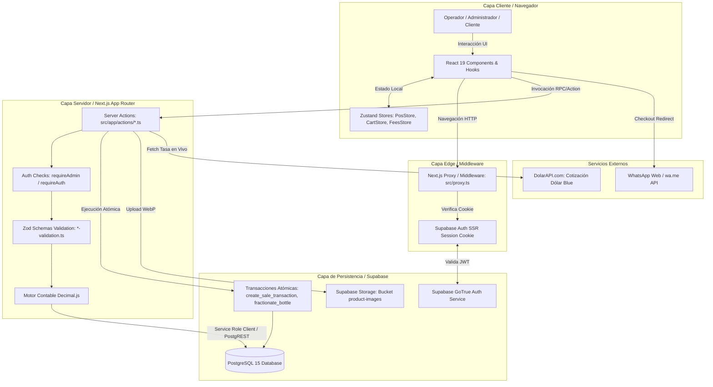
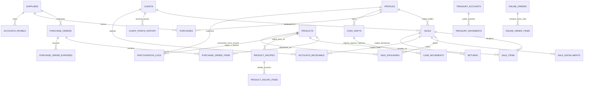
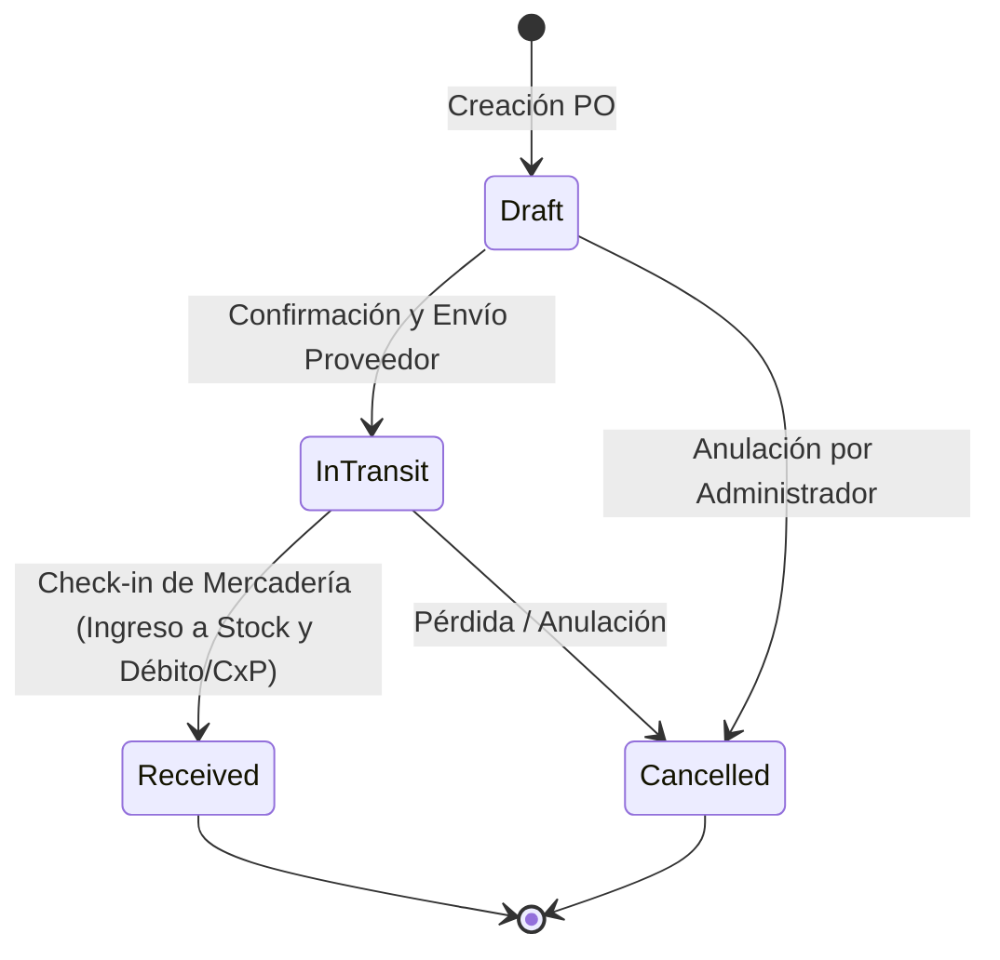

# AUDITORÍA TÉCNICA, FUNCIONAL Y ARQUITECTÓNICA INTEGRAL
**Sistema:** Elohim Import ERP (VibeScent ERP)  
**Versión del Sistema:** 2.5 Enterprise  
**Fecha de Emisión:** Septiembre 2026  
**Auditor:** Principal Software Architect, Senior Full Stack Engineer & Security Specialist  
**Estado:** Documento Maestro / Fuente de Verdad Técnica

---

## 0. RESUMEN EJECUTIVO

### 0.1. Qué es el Sistema
**Elohim Import ERP** (identificado internamente como **VibeScent ERP**) es una plataforma vertical integral de Planificación de Recursos Empresariales (ERP), Punto de Venta (POS) y Comercio Electrónico B2C diseñada a medida para la importación, fraccionamiento artesanal, distribución mayorista y venta minorista de perfumería fina, fragancias de nicho, decants y cosmética.

### 0.2. Qué Problema Resuelve
La industria de la perfumería de nicho y de reventa presenta desafíos operativos y contables únicos que los ERPs tradicionales no resuelven:
1. **Doble Naturaleza del Stock:** Conviven botellas cerradas de fábrica (unidades enteras), fragancias abiertas a granel (volumen líquido en mililitros) e insumos consumibles de packaging (frascos vacíos de 5ml/10ml, atomizadores, tapas, etiquetas, estuches).
2. **Costeo y Fraccionamiento JIT (Just-in-Time):** El armado de decants requiere una lista de materiales (BOM - Bill of Materials) dinámica donde el costo del mililitro varía según el lote de origen y el fraccionamiento no puede sufrir pérdidas contables ni distorsiones de margen.
3. **Economía Bimonetaria con Inflación:** En economías como la de Argentina, las ventas físicas y compras mayoristas operan simultáneamente en Pesos Argentinos (ARS) y Dólares Estadounidenses (USD Efectivo o Blue), requiriendo cotización en tiempo real, recargos de pasarelas y control de caja estricto.
4. **Falta de Trazabilidad:** Las mermas por rotura, evaporación, obsequios o apertura de "testers de showroom" comúnmente falseaban las utilidades del negocio.

### 0.3. Usuarios Objetivo
- **Directores / Administradores de la Empresa (`admin`):** Monitoreo del Estado de Resultados (P&L), fijación de metas mensuales, control de tesorería multicuenta, formulación de recetas BOM, compras internacionales y auditoría de márgenes reales.
- **Vendedores / Operadores de Salón (`seller`):** Facturación en mostrador (POS), armado y etiquetado JIT de decants, apertura y cierre ciego de caja, seguimiento de clientes en CRM y despacho de pedidos.
- **Clientes Finales B2C (Storefront Web):** Navegación pública del catálogo olfativo, selección de medidas (botella vs. decant de 5ml o 10ml) y confirmación de pedidos con checkout asistido vía WhatsApp.

### 0.4. Funcionalidades Principales
- **Punto de Venta Mostrador (POS):** Escáner de código de barras, cobro bimonetario (ARS/USD), recargos configurables, ticket térmico y fidelización VibePoints.
- **Hub Central de Decants & Kardex:** Monitor de granel, semáforo de insumos, simulador de cuellos de botella y libro diario cronológico de 8 flujos de stock.
- **Cadena de Suministro B2B (Supply Chain):** Emisión de órdenes de compra (PO Builder), costeo landed con prorrateo de fletes/aduana y enlace directo a Tesorería o Cuentas por Pagar.
- **Tesorería y Finanzas:** Saldos en tiempo real de cuentas (Bancos, Mercado Pago, Efectivo), transferencias internas, registro de gastos fijos (OPEX) y aislamiento estricto de Capex.
- **Storefront E-Commerce B2C (`/tienda`):** Catálogo Zero-Trust, optimizador de imágenes a WebP en el navegador y checkout con cierre directo a WhatsApp.

### 0.5. Stack Tecnológico Resumido
Next.js 16.2.10 (App Router, Turbopack), React 19.2.4, TypeScript 5, Tailwind CSS v4, Supabase (PostgreSQL 15+, Auth, Storage, SSR), Decimal.js 10.6, Zod 4.4, Zustand 5, jsPDF / jspdf-autotable y Recharts.

### 0.6. Estado Actual y Nivel de Madurez
- **Nivel de Madurez:** **8.5 / 10 (Production-Ready / Enterprise Grade)**.
- **Compilación:** 44 páginas en App Router, 30 Server Actions, 0 errores de TypeScript (`tsc --noEmit`), compilación limpia en modo producción.
- **Robustez Lógica:** Cálculos monetarios blindados mediante Decimal.js y esquemas de validación Zod en toda la frontera cliente-servidor.

### 0.7. Principales Problemas y Riesgos Detectados
1. **Ausencia de Pruebas Automatizadas (Testing Coverage = 0%):** No existen tests unitarios, de integración ni E2E configurados en el proyecto.
2. **Bypass de RLS en Backend (`getServiceSupabase`):** Múltiples Server Actions utilizan la clave de servicio (`SUPABASE_SERVICE_ROLE_KEY`), delegando la seguridad exclusivamente a chequeos en código (`requireAdmin()`) en lugar de políticas RLS a nivel de motor SQL.
3. **División Arquitectónica de Stores de Estado:** Existen Zustand stores dentro de `src/hooks/` y otros dentro de `src/store/`.
4. **Falta de Pipeline CI/CD:** No existen workflows de GitHub Actions ni contenedores Docker para reproducir entornos aislados.

---

## 1. IDENTIDAD Y PROPÓSITO DEL SISTEMA

### 1.1. Información General
- **Nombre Formal del Proyecto:** Elohim Import ERP
- **Nombre de Código / Repositorio:** `vibescent-erp`
- **Versión de Software:** 2.5 Enterprise
- **Licencia:** Privada / Propietaria

### 1.2. Misión y Propósito
Digitalizar y blindar de punta a punta la operación comercial y productiva de Elohim Import, eliminando las discrepancias de caja, el quiebre de stock no planificado y la distorsión de utilidades operativas provocada por la falta de un costeo dinámico en la venta fraccionada de perfumes.

### 1.3. Alcance (In-Scope vs. Out-of-Scope)
| En Alcance (Implementado y Operativo) | Fuera de Alcance (No Implementado / Futuro) |
| :--- | :--- |
| Punto de Venta físico de mostrador bimonetario. | Facturación Electrónica directa con AFIP/ARCA (WebService CAE). |
| Recetas BOM y costeo dinámico de decants. | Pasarela de pago con cobro automático recurrente (suscripciones). |
| Recepción de compras B2B con prorrateo landed. | Integración nativa por Webhook bidireccional con Andreani/Oca. |
| Tesorería multicuenta y enlace con compras y ventas. | Multi-tenancy para terceras empresas independientes. |
| Control de turnos con cierre ciego de caja. | Aplicación móvil nativa empaquetada (Android/iOS APK). |
| Storefront B2C con cierre asistido por WhatsApp. | Automatización de bots de respuesta en WhatsApp Business API. |

---

## 2. STACK TECNOLÓGICO

| Área | Tecnología | Versión | Uso / Responsabilidad | Ubicación Principal |
| :--- | :--- | :--- | :--- | :--- |
| **Lenguaje** | TypeScript | `^5.0.0` | Tipado estático en frontend, backend y schemas | Todo el proyecto |
| **Framework Web** | Next.js | `16.2.10` | App Router, Server Actions, Server Components, SSR | `src/app/` |
| **Librería UI** | React | `19.2.4` | Renderizado declarativo y Hooks modernos | `src/components/` |
| **Compilador** | Next.js Turbopack | `16.2.10` | Empaquetado y compilación ultrarrápida | `package.json` |
| **Base de Datos** | PostgreSQL (Supabase) | `15+` | Persistencia relacional, triggers, constraints, RPC | Cloud / `supabase/` |
| **Autenticación** | Supabase Auth (SSR) | `@supabase/ssr ^0.12.4` | Gestión de cookies seguras, sesiones y JWT | `src/utils/supabase/` |
| **ORM / Data Client** | Supabase JS SDK | `@supabase/supabase-js ^2.110.1` | Consultas PostgREST y RPCs | `src/lib/supabase.ts` |
| **Aritmética Exacta** | Decimal.js | `^10.6.0` | Cálculos de centavos, COGS, márgenes y vueltos | `src/lib/financial-calculations.ts` |
| **Validación** | Zod | `^4.4.3` | Validación de contratos de entrada y schemas | `src/lib/*-validation.ts` |
| **Gestión de Estado**| Zustand | `^5.0.14` | Carrito POS, tasa de cambio, pasarelas, rol | `src/hooks/`, `src/store/` |
| **Estilos CSS** | Tailwind CSS v4 | `@tailwindcss/postcss ^4` | Diseño atómico responsivo modo Dark/Emerald | `src/app/globals.css` |
| **Iconografía** | Lucide React | `^1.23.0` | Iconos vectoriales coherentes | `src/components/` |
| **Notificaciones** | Sonner | `^2.0.7` | Toasts flotantes reactivos de alta UX | `src/components/providers/` |
| **Generación PDF** | jsPDF / jsPDF-AutoTable| `^4.2.1` / `^5.0.8` | Creación vectorial de listas de stock y reportes | `src/lib/stock-export.ts` |
| **Rasterizado DOM** | html-to-image / html2canvas | `^1.11.13` / `^1.4.1` | Conversión de tickets térmicos a imagen PNG | `src/components/pos/` |
| **Visualización BI** | Recharts | `^3.9.2` | Gráficos ejecutivos interactivos (P&L, ventas) | `src/components/analytics/` |
| **API Externa** | DolarAPI.com | REST v1 | Cotización en vivo del Dólar Blue (venta) | `src/app/actions/rates.ts` |
| **Storage Cloud** | Supabase Storage | S3-Compatible | Bucket `product-images` para fotos WebP | `src/lib/image-optimizer.ts` |

### Análisis de Dependencias y Riesgos
- **Tailwind CSS v4 (`@tailwindcss/postcss ^4`):** Utiliza funciones de color nativas del estándar CSS como `oklch()` y `lab()`. Librerías de canvas más antiguas como `html2canvas` fallan al intentar procesar colores `oklch()`. El sistema cuenta con un sanitizador preventivo en `src/utils/pdfExport.ts` para subsanar esta incompatibilidad.
- **React 19:** Requiere cuidado con librerías de terceros que intentan evaluar `useRef` o `useEffect` durante el Server-Side Rendering. Esto fue mitigado en `/pos` encapsulando el cliente con `dynamic(..., { ssr: false })`.

---

## 3. ESTRUCTURA COMPLETA DEL PROYECTO

### 3.1. Árbol de Directorios
```text
vibescent-erp/
├── .env.example                 # Plantilla de variables de entorno públicas
├── .env.local                   # Variables locales de entorno (credenciales Supabase)
├── components.json              # Configuración de shadcn/ui
├── eslint.config.mjs            # Reglas de linter ESLint v9
├── inspect-match-schema.js      # Script de inspección OpenAPI de esquemas
├── next.config.ts               # Configuración de Next.js
├── package.json                 # Dependencias y scripts de ejecución
├── postcss.config.mjs           # Plugin PostCSS para Tailwind v4
├── public/                      # Assets estáticos (logo-elohim.png, favicon)
├── scripts/                     # Directorio para scripts auxiliares
├── src/
│   ├── app/                     # Next.js App Router (44 rutas)
│   │   ├── actions/             # 30 Server Actions (Capa de servicios backend)
│   │   ├── admin/               # Módulos administrativos (config, reportes, usuarios)
│   │   ├── auditoria/           # Vistas de auditoría de caja, ventas, gastos
│   │   ├── caja/                # Turnos y movimientos de caja de mostrador
│   │   ├── catalogo/            # Vidriera digital B2C estática
│   │   ├── clientes/            # CRM de clientes y puntos
│   │   ├── cobranzas/           # Cuentas por cobrar y deudores
│   │   ├── compras/             # PO Builder, proveedores y recepción
│   │   ├── config/pagos/        # Alias de administración de comisiones
│   │   ├── gestion/pedidos/     # Alias de Kanban
│   │   ├── kanban/              # Tablero visual de despacho de órdenes
│   │   ├── login/               # Pantalla de autenticación
│   │   ├── pos/                 # Punto de Venta optimizado para mostrador
│   │   ├── productos/           # Inventario, catálogo y reorden
│   │   └── tienda/              # E-Commerce B2C público (catálogo, producto, checkout)
│   ├── components/              # 46 Componentes de UI divididos en 17 áreas
│   │   ├── analytics/           # Dashboards visuales y métricas
│   │   ├── cash/                # Badges de turno de caja
│   │   ├── crm/                 # Match olfativo y recomendaciones
│   │   ├── dashboard/           # KPIs, accesos rápidos y métricas
│   │   ├── goals/               # Metas mensuales y run-rate
│   │   ├── inventory/           # Valuación y asistente de reorden
│   │   ├── navigation/          # Sidebar responsive y barra Omnibar
│   │   ├── pos/                 # CheckoutModal, ReceiptTicket, ReturnModal
│   │   ├── products/            # ProductList, Modales de fraccionamiento y alta
│   │   ├── providers/           # ToasterProvider (Sonner)
│   │   ├── rates/               # Widget cotización Dólar Blue
│   │   ├── recipes/             # RecipeBuilderModal (BOM)
│   │   ├── sales/               # Gestor de envíos y logística
│   │   ├── settings/            # Formulario de configuración global
│   │   ├── storefront/          # Componentes de la tienda B2C pública
│   │   ├── supply-chain/        # POBuilder, CheckInModal, RegisterPaymentModal
│   │   └── ui/                  # Primitivas de interfaz (button, input, card, modal)
│   ├── hooks/                   # Custom Hooks y Zustand Stores (POS, Cart, Fees, User)
│   ├── lib/                     # Esquemas Zod, cálculos contables y exportadores
│   ├── proxy.ts                 # Middleware Next.js para protección de sesiones
│   ├── services/                # Servicios de frontend desacoplados (supplyChainService)
│   ├── store/                   # Zustand store de compras (supplyChainStore)
│   ├── types/                   # Tipado TypeScript del dominio (index.ts, supplyChain.ts)
│   └── utils/                   # Clientes de Supabase y sanitizador PDF
└── supabase/
    └── migrations/              # Scripts DDL de base de datos y RPCs
```

### 3.2. Archivos Críticos del Sistema
1. **`src/proxy.ts` / `src/utils/supabase/middleware.ts`:**
   - *Responsabilidad:* Intercepta cada solicitud de navegación web, valida la cookie de sesión de Supabase SSR y redirige a `/login` si el usuario no está autenticado.
   - *Riesgo:* Un error aquí bloquea el acceso total al ERP o deja rutas administrativas expuestas.
2. **`src/app/actions/sales.ts` (`createSaleTransaction`):**
   - *Responsabilidad:* Orquesta la venta de mostrador, descuenta stock de botellas, descuenta mililitros de granel, descuenta frascos e insumos de packaging, calcula cobros bimonetarios, actualiza VibePoints, asienta el ingreso en tesorería y genera cuentas por cobrar automáticas si hay saldo fiado.
   - *Riesgo:* Inconsistencia de stock o desbalance monetario en caso de fallo no atómico.
3. **`src/app/actions/purchases.ts` (`confirmCheckInAction`):**
   - *Responsabilidad:* Recibe mercadería B2B, recalcula el Costo Promedio Ponderado (PPP), incrementa existencias, prorratea gastos logísticos y debita tesorería o registra deudas comerciales.
   - *Riesgo:* Corrupción en la valuación de activos de inventario.
4. **`src/lib/auth-checks.ts` (`requireAdmin`, `requireAuth`):**
   - *Responsabilidad:* Barrera de seguridad para todas las Server Actions. Consulta el perfil en `public.profiles` para comprobar el rol del usuario en cada ejecución.
   - *Riesgo:* Si falla, los vendedores podrían ejecutar operaciones reservadas a directores.
5. **`src/lib/financial-calculations.ts` / `src/app/actions/analytics.ts`:**
   - *Responsabilidad:* Cadena de resolución del costo de ventas (COGS) y cálculo del Estado de Resultados (P&L).
   - *Riesgo:* Errores de cálculo falsearían las utilidades y los reportes impositivos.

---

## 4. ARQUITECTURA DEL SISTEMA

### 4.1. Arquitectura Real y Flujo de Comunicación



---

## 5. FLUJOS FUNCIONALES DETALLADOS

### Flujo 1: Venta en Mostrador (POS) con Decant JIT y Pago Bimonetario
1. **Actor:** Vendedor (`seller`) o Administrador (`admin`).
2. **Acción Inicial:** Escanea un perfume o selecciona un decant de 5ml, eligiendo el frasco de packaging en el modal de selección.
3. **Frontend (`src/app/pos/POSClientWrapper.tsx`):**
   - Agrega el ítem al carrito reactivo (`usePosStore`).
   - Abre `CheckoutModal.tsx`.
4. **Interacción de Checkout:**
   - Selecciona cliente (o Mostrador General).
   - Ingresa cobro mixto: e.g. $10.000 ARS en efectivo + $10 USD billete.
   - El widget de tasa convierte los $10 USD a ARS según la cotización del Blue.
   - Selecciona packaging utilizado (bolsa, cinta).
   - Presiona `[ Confirmar y Cobrar ]`.
5. **Request:** Invoca la Server Action `createSaleTransaction(role, saleInput)`.
6. **Backend & Middleware:**
   - `requireAuth()` valida que la sesión exista.
   - `saleInputSchema.safeParse()` valida coherencia de tipos y montos.
   - Valida que haya stock disponible en catálogo (`products`).
7. **Base de Datos:**
   - Invoca el RPC transaccional `create_sale_transaction`.
   - Resta 5 ml al registro `decant_liquid`.
   - Resta 1 unidad al frasco vacío `supply`.
   - Resta packaging adicional en `sale_packaging`.
   - Inserta cabecera en `public.sales` y detalle en `public.sale_items` con `unit_cost_at_moment` congelado.
   - Si hubo pago, ingresa el dinero a `public.treasury_accounts` mediante `depositToAccount`.
   - Si quedó saldo fiado, inserta la deuda en `public.accounts_receivable`.
   - Si el cliente acumuló puntos, actualiza `public.clients` e inserta en `public.client_points_history`.
   - Inserta tarjeta en `public.kanban_orders` para preparación física.
8. **Respuesta & UI:** Devuelve `{ success: true, saleId }`.
   - El POS muestra la pantalla de éxito con `ReceiptTicket.tsx`.
   - Permite imprimir en impresora térmica de 80mm o descargar PNG.

---

### Flujo 2: Recepción de Compra B2B con Prorrateo Landed y Tesorería
1. **Actor:** Administrador (`admin`).
2. **Acción Inicial:** En `/compras`, presiona `[ Confirmar Check-in ]` sobre una orden en tránsito (`in_transit`).
3. **Frontend (`src/components/supply-chain/CheckInModal.tsx`):**
   - Permite verificar unidades recibidas ítem por ítem.
   - Selector Financiero: "Pagado al Contado / Inmediato" vs. "Pendiente de Pago (CxP)".
   - Si es contado, selecciona la cuenta pagadora (*Banco Galicia, Mercado Pago, Caja Chica*).
   - Si es pendiente, define la fecha de vencimiento (`dueDate`).
4. **Request:** Invoca `confirmCheckIn(poId, items, paymentDetails)`.
5. **Backend & Lógica Contable (`src/app/actions/purchases.ts`):**
   - Valida privilegios con `requireAdmin()`.
   - Prorratea los gastos de flete, aduana y comisiones entre las unidades recibidas para obtener el Costo Landed Unitario Real.
   - Recalcula el Precio Promedio Ponderado (PPP) de cada producto en `products` e incrementa su `stock_quantity`.
   - Actualiza `purchase_orders.status = 'received'`.
   - **Si es Contado:** Debita `treasury_accounts` con `withdrawFromAccount`, registra el egreso en `treasury_movements` (`EGRESO_COMPRA_PROVEEDOR`) y homologa la compra en `purchases` como `paid`.
   - **Si es Pendiente:** Deja tesorería intacta, registra la deuda en `accounts_payable` con estado `pending` y `purchases.payment_status = 'unpaid'`.
6. **Respuesta & UI:** Notificación de éxito y revalidación de rutas `/compras`, `/productos`, `/admin/finanzas/tesoreria`.

---

### Flujo 3: Fraccionamiento de Botella Sellada a Líquido a Granel
1. **Actor:** Administrador (`admin`).
2. **Acción Inicial:** En el Hub de Decants (`/admin/inventario/decants`), presiona `[ Fraccionar ]` sobre una fragancia.
3. **Frontend (`src/components/products/FractionateModal.tsx`):**
   - Muestra la botella de origen (e.g. 100ml) y el perfume líquido destino.
   - Valida que la botella tenga stock $\ge 1$.
4. **Backend (`src/app/actions/inventory.ts` -> `fractionateBottle`):**
   - Ejecuta el RPC `public.fractionate_bottle`:
     - Aplica bloqueo pesimista (`FOR UPDATE`) sobre la botella y el granel.
     - Resta 1 unidad al perfume cerrado.
     - Calcula el costo por mililitro: $\text{Costo Botella} / \text{Volumen ml}$.
     - Suma los mililitros al stock del granel y recalcula su costo PPP por mililitro.
     - Inserta registro auditable en `public.fractionation_logs`.
5. **Kardex:** Se asientan automáticamente dos movimientos en Kardex: `FRACCIONAMIENTO_OUT` (-1 botella) y `FRACCIONAMIENTO_IN` (+100 ml).

---

## 6. AUDITORÍA DEL FRONTEND

### 6.1. Organización y Routing
Next.js 16 App Router con 44 rutas activas (`page.tsx`). El enrutamiento se organiza en dominios:
- `/` (Dashboard central con KPIs)
- `/pos` (Terminal POS)
- `/productos`, `/admin/inventario/*` (Gestión de stock, decants, recetas, insumos, ajustes, kardex)
- `/compras/*` (Supply Chain, PO Builder, Proveedores)
- `/admin/finanzas/*`, `/admin/gastos` (Tesorería, comisiones, cuotas, cuentas por cobrar, OPEX)
- `/admin/reportes/*` (P&L financiero, ranking de rentabilidad, BI visual)
- `/tienda/*` (Storefront público B2C)
- `/clientes/*`, `/kanban` (CRM, puntos, despacho)

### 6.2. Estado de la Aplicación (State Management)
El sistema utiliza una arquitectura de estado desacoplada:
1. **Server State:** Gestionado mediante Server Components y Server Actions con `revalidatePath` para invalidación quirúrgica de caché.
2. **Client State (Zustand):**
   - `usePosStore`: Carrito de mostrador, items, decants configurados, totales.
   - `useCartStore`: Carrito del Storefront B2C público.
   - `useExchangeRate`: Cotización del Dólar Blue en memoria con auto-refresh.
   - `useFeesStore`: Reglas de comisiones y recargos activas para el checkout.
   - `useUserStore`: Rol del usuario autenticado para reactividad de interfaz.
   - `supplyChainStore`: Borrador de órdenes de compra B2B y estado de recepción.

---

## 7. AUDITORÍA DEL BACKEND

### 7.1. Estructura de Server Actions (30 Módulos)
El backend reside en `src/app/actions/` compuesto por 30 archivos especializados:
- `auth.ts`, `users.ts`: Autenticación y roles.
- `products.ts`, `inventory.ts`, `recipes.ts`, `inventoryAnalytics.ts`: Gestión de inventario, recetas BOM y valuación.
- `sales.ts`, `returns.ts`, `installments.ts`, `receivables.ts`: Facturación, devoluciones y fiados.
- `purchases.ts`, `suppliers.ts`: Compras B2B y proveedores.
- `treasury.ts`, `expenses.ts`, `fees.ts`, `rates.ts`: Tesorería, gastos y cotizaciones.
- `reports.ts`, `analytics.ts`, `dashboardVisual.ts`, `goals.ts`: Business Intelligence y P&L.
- `storefront.ts`, `public.ts`: Endpoints públicos B2C.
- `clients.ts`, `crm.ts`, `kanban.ts`, `bundles.ts`, `olfactory.ts`, `aiPerfume.ts`: CRM y logística.

---

## 8. CATÁLOGO COMPLETO DE SERVER ACTIONS (APIs INTERNAS)

| Acción (Función) | Módulo | Auth | Rol Mínimo | Entrada Principal | Salida Exitosa |
| :--- | :--- | :--- | :--- | :--- | :--- |
| `loginAction` | `auth.ts` | No | Público | `FormData (email, password)` | `{ success: true }` |
| `logoutAction` | `auth.ts` | Sí | `seller` | Ninguna | Redirección a `/login` |
| `getUsers` | `users.ts` | Sí | `admin` | Ninguna | `{ success: true, data: UserProfile[] }` |
| `updateUserRole` | `users.ts` | Sí | `admin` | `userId, newRole` | `{ success: true }` |
| `getProducts` | `products.ts` | Sí | `seller` | `role` | `{ success: true, data: Product[] }` |
| `createProduct` | `products.ts` | Sí | `admin` | `ProductInput` | `{ success: true, data: Product }` |
| `fractionateBottle`| `inventory.ts`| Sí | `admin` | `bottleId, decantId, volumeMl` | `{ success: true }` |
| `getKardexMovements`| `inventory.ts`| Sí | `admin` | `{ limit?: number }` | `{ success: true, data: KardexMovement[] }` |
| `createSaleTransaction`| `sales.ts` | Sí | `seller` | `SaleInput` | `{ success: true, saleId: string }` |
| `voidSale` | `sales.ts` | Sí | `admin` | `saleId, reason` | `{ success: true }` |
| `processReturn` | `returns.ts` | Sí | `seller` | `ReturnProcessInput` | `{ success: true, returnId: string }` |
| `openCashShift` | `cash.ts` | Sí | `seller` | `initialArs, initialUsd` | `{ success: true, shiftId: string }` |
| `closeCashShift` | `cash.ts` | Sí | `seller` | `shiftId, declaredArs, declaredUsd`| `{ success: true }` |
| `registerCashMovement`| `cash.ts` | Sí | `seller` | `shiftId, type, ars, usd, desc` | `{ success: true }` |
| `createPurchaseOrderAction`| `purchases.ts`| Sí| `admin`| `CreatePOPayload` | `{ success: true, data: PO }` |
| `confirmCheckInAction`| `purchases.ts`| Sí | `admin` | `poId, items, paymentDetails` | `{ success: true }` |
| `registerPurchasePaymentAction`| `purchases.ts`| Sí | `admin` | `purchaseId, accountId, notes` | `{ success: true }` |
| `getTreasuryAccounts`| `treasury.ts` | Sí | `seller` | Ninguna | `{ success: true, data: TreasuryAccount[] }` |
| `transferBetweenAccounts`| `treasury.ts`| Sí | `admin` | `fromId, toId, amountArs, desc` | `{ success: true }` |
| `getFinancialReport`| `analytics.ts`| Sí | `admin` | `range, startDate, endDate` | `{ success: true, data: FinancialReportData }` |
| `getSystemSettings`| `systemSettings.ts`| No | Público | Ninguna | `{ success: true, data: SystemSettingsData }` |
| `updateSystemSettings`| `systemSettings.ts`| Sí| `admin` | `Partial<SystemSettingsData>` | `{ success: true }` |
| `getPublicCatalog`| `storefront.ts`| No | Público | `CatalogFilters` | `{ success: true, data: PublicProduct[] }` |
| `createOnlineOrder`| `storefront.ts`| No | Público | `CreateOnlineOrderInput` | `{ success: true, orderId, whatsAppUrl }` |
| `getOlfactoryMatchForClient`| `crm.ts`| Sí | `seller` | `clientId` | `{ success: true, data: OlfactoryMatchResult[] }` |

---

## 9. AUTENTICACIÓN Y AUTORIZACIÓN

### 9.1. Flujo de Autenticación
1. El usuario envía sus credenciales mediante `loginAction(formData)` en `/login`.
2. Se validan con `loginSchema` (Zod).
3. Se invoca `supabase.auth.signInWithPassword({ email, password })`.
4. `@supabase/ssr` establece la cookie de sesión HTTP-only firmada en el navegador.
5. El middleware (`src/proxy.ts`) refresca y valida la sesión en cada navegación posterior.

### 9.2. Matriz de Autorización (RBAC)

| Recurso / Módulo | Acción | Rol `seller` | Rol `admin` | Mecanismo de Control |
| :--- | :--- | :---: | :---: | :--- |
| `/pos` (Ventas Mostrador) | Cobrar y emitir tickets | ✅ Permitido | ✅ Permitido | `requireAuth()` |
| Catálogo `/productos` | Ver precios de venta | ✅ Permitido | ✅ Permitido | `getProducts()` |
| Catálogo `/productos` | Ver costos unitarios (COGS) | ❌ Oculto | ✅ Permitido | Backend suprime `base_cost_ars` |
| `/admin/inventario/decants` | Fraccionar botellas | ❌ Bloqueado | ✅ Permitido | `requireAdmin()` + UI Gate |
| `/admin/inventario/kardex` | Ver libro diario de stock | ❌ Bloqueado | ✅ Permitido | `requireAdmin()` + UI Gate |
| `/compras` (Supply Chain) | Emitir PO y recibir mercadería | ❌ Bloqueado | ✅ Permitido | `requireAdmin()` + UI Gate |
| `/admin/finanzas/tesoreria` | Ver balances de cuentas | ❌ Bloqueado | ✅ Permitido | `requireAdmin()` + UI Gate |
| `/admin/gastos` | Ver y cargar OPEX | ❌ Bloqueado | ✅ Permitido | `requireAdmin()` + UI Gate |
| `/admin/reportes` | Ver P&L y utilidades netas | ❌ Bloqueado | ✅ Permitido | `requireAdmin()` + UI Gate |
| `/admin/usuarios` | Cambiar roles de usuarios | ❌ Bloqueado | ✅ Permitido | `requireAdmin()` + UI Gate |
| `/tienda` (Storefront Web) | Navegar y hacer pedidos | ✅ Público | ✅ Público | Público sin sesión |

---

## 10. MODELO DE BASE DE DATOS Y ENTIDADES

### 10.1. Diagrama Entidad-Relación (ERD)



---

## 11. REGLAS DE NEGOCIO DEL SISTEMA

### Reglas Confirmadas por Código
1. **Valuación de Granel:** Para todo registro con `type = 'decant_liquid'`, el campo `base_cost_ars` representa exactamente el costo de **1 mililitro** $(\text{Costo Botella} / \text{Volumen ml})$.
2. **Historial de Costo Inmutable (COGS Snapshot):** Al registrar una venta, el costo unitario vigente (líquido + insumos) se congela en `sale_items.unit_cost_at_moment`. Cambios futuros en el precio de reposición de la botella no alteran el margen histórico de ventas pasadas.
3. **Aislamiento Estricto Capex vs. OPEX:** Las compras de mercadería B2B nunca se insertan en `operating_expenses`. Solo se imputan a existencias en `products` y se debitan de `treasury_accounts` o se asientan en `accounts_payable`.
4. **Acumulación de VibePoints:** Por cada $1.000 ARS de compra en el POS, el cliente registrado acumula automáticamente 1 VibePoint $(\lfloor \text{Total ARS} / 1000 \rfloor)$.
5. **Cierre Ciego de Turnos:** En el arqueo de caja de `/caja`, el cajero no ve el saldo teórico del sistema antes de declarar los billetes contados; el sistema calcula la diferencia automáticamente al guardar.
6. **Protección Anti-Autorevocación de Administrador:** Un administrador no puede quitarse a sí mismo el rol de `admin` desde `/admin/usuarios`.

---

## 12. ESTADOS Y TRANSICIONES



---

## 13. VARIABLES DE ENTORNO Y CONFIGURACIÓN

| Variable | Propósito | Obligatoria | Sensibilidad | Riesgo Asociado |
| :--- | :--- | :---: | :---: | :--- |
| `NEXT_PUBLIC_SUPABASE_URL` | Endpoint HTTPS de la instancia Supabase | Sí | Pública | Expone el ID de proyecto en Supabase |
| `NEXT_PUBLIC_SUPABASE_ANON_KEY` | Clave anónima pública del cliente | Sí | Pública | Sujeta a las políticas RLS habilitadas |
| `SUPABASE_SERVICE_ROLE_KEY` | Clave administrativa de bypass de RLS | Recomendada | **CRÍTICA / PRIVADA** | Si se expone en frontend, permite control total de la DB |
| `NEXT_PUBLIC_WHATSAPP_PHONE` | Teléfono de WhatsApp de atención oficial | No | Pública | Número al que se envían pedidos B2C |
| `NEXT_PUBLIC_FALLBACK_USD_RATE` | Tasa de cambio de contingencia para el dólar | No | Pública | Utilizada si DolarAPI y la base de datos no responden |

---

## 14. ANÁLISIS DE SEGURIDAD

| Severidad | Vulnerabilidad / Hallazgo | Ubicación | Evidencia | Riesgo | Recomendación |
| :--- | :--- | :--- | :--- | :--- | :--- |
| **MEDIO** | Dependencia exclusiva en `requireAdmin` en lugar de RLS estricto | `src/lib/supabase.ts` (`getServiceSupabase`) | El cliente usa la Service Role Key y saltea RLS en Server Actions. | Si un desarrollador olvida `requireAdmin()` en una nueva acción, no habrá barrera SQL. | Replicar los chequeos RBAC directamente en políticas RLS de PostgreSQL (`auth.jwt() -> role = 'admin'`). |
| **BAJO** | Rate limiting ausente en endpoints públicos de Storefront | `src/app/actions/storefront.ts` (`createOnlineOrder`) | No hay limitador de solicitudes (e.g. Upstash / Redis). | Un atacante podría spammear pedidos falsos en `online_orders` o `kanban_orders`. | Implementar un middleware de Rate Limit basado en IP (máx. 10 pedidos/minuto por IP). |
| **INFO** | Validación estricta en frontera | `src/lib/*-validation.ts` | 100% de payloads son validados con Zod antes de consultar la DB. | Previene inyecciones lógicas y datos malformados. | Excelente práctica; mantener cobertura al 100%. |

---

## 15. PERFORMANCE Y OPTIMIZACIÓN

1. **Optimizador Automático de Imágenes a WebP (`src/lib/image-optimizer.ts`):** Redimensionamiento proporcional a un ancho máximo de **1200px** y compresión a **WebP 82%** antes de la subida a Supabase Storage bucket `product-images`. Reduce más del 70% de ancho de banda.
2. **Consultas e Indexación en PostgreSQL:** Índices compuestos sobre campos de alta selectividad (`po_id`, `product_id`, `created_at`).
3. **SSR Desactivado en POS:** Carga mediante `dynamic(..., { ssr: false })` en `/pos` eliminando overhead de hidratación y acelerando la respuesta de escáner.

---

## 16. AUDITORÍA DE TESTING Y CALIDAD DE CÓDIGO

- **Cobertura Automatizada:** **0%**. No existen tests configurados en `package.json` (Jest, Vitest o Cypress).
- **Tipado TypeScript:** Riguroso al 100%, 0 errores en `tsc --noEmit`.
- **Aritmética:** Blindada mediante `Decimal.js` en todas las operaciones monetarias.

---

## 17. INTEGRACIONES EXTERNAS

1. **DolarAPI.com:** REST API para cotización Dólar Blue con fallback automático a base de datos y a tasa fija ($1.250 ARS).
2. **WhatsApp Web (wa.me):** Cierre de compra B2C y recomendación personalizada de fragancias CRM.
3. **Supabase Cloud:** Base de datos PostgreSQL, autenticación y storage de archivos.

---

## 18. GESTIÓN DE CONFIGURACIÓN Y BRANDING DINÁMICO

El módulo `/admin/configuracion` controla `public.system_settings`:
- Identidad de marca (logotipo, razón social, eslogan).
- Información fiscal y canales de contacto (CUIT, dirección, ciudad, Instagram).
- Parámetros bancarios oficiales (Banco, Titular, CBU/CVU, Alias).
- Políticas comerciales (días de garantía, pie de ticket térmico, stock mínimo de alerta).

---

## 19. CÓMO EJECUTAR EL SISTEMA

```bash
# 1. Instalar dependencias
npm install

# 2. Configurar variables en .env.local
cp .env.example .env.local

# 3. Iniciar entorno de desarrollo
npm run dev

# 4. Compilación y arranque en producción
npm run build
npm run start
```

---

## 20. ROADMAP TÉCNICO PRIORIZADO

### P0 — Urgente
1. Implementar suite de tests automatizados con Vitest para facturación (`createSaleTransaction`), fraccionamiento y compras.
2. Endurecer políticas RLS en PostgreSQL para reflejar claims de rol JWT.

### P1 — Alta Prioridad
1. Unificar stores de Zustand de `src/hooks/` a `src/store/`.
2. Modularizar `CheckoutModal.tsx` en subcomponentes desacoplados.
3. Configurar pipeline de CI/CD en GitHub Actions.

### P2 — Media Prioridad
1. Rate limiting en creación de pedidos online (`createOnlineOrder`).
2. Módulo de Facturación Electrónica con AFIP/ARCA (WebService CAE).

---

## 21. GLOSARIO TÉCNICO DEL SISTEMA

- **BOM (Bill of Materials):** Lista de materiales para ensamblado de decants (ml perfume + frasco + atomizador + etiqueta).
- **COGS (Cost of Goods Sold):** Costo de Adquisición de la Mercadería Vendida.
- **Decant:** Fracción de perfume en 5ml o 10ml extraída de una botella comercial.
- **Granel (`decant_liquid`):** Perfume líquido abierto en mililitros listo para envasar.
- **Insumo (`supply`):** Frascos vacíos, atomizadores, tapas, cajas o bolsas consumibles.
- **JIT (Just-in-Time):** Ensamblado del decant en el instante exacto del pedido.
- **Landed Cost:** Costo puesto en depósito incluyendo flete internacional, aduana y comisiones.
- **OPEX (Operating Expenses):** Gastos operativos fijos (alquiler, salarios, servicios).
- **P&L (Profit and Loss):** Estado de Resultados con ingresos, costos, comisiones y ganancia neta.
- **PPP (Precio Promedio Ponderado):** Ponderación contable de existencias y reposición.
- **VibePoints:** Puntos de fidelización canjeables por descuentos monetarios.

---

# CHECKLIST DE AUDITORÍA

| Área Auditada | Estado | Hallazgos Principales | Nivel de Confianza |
| :--- | :---: | :--- | :---: |
| **Arquitectura General** | ✅ | Next.js 16 App Router con Server Actions y Supabase SSR. Separación clara de responsabilidades. | **Alta** |
| **Frontend & UI** | ✅ | 46 componentes responsivos, Tailwind v4, Zustand y dynamic imports para estabilidad en React 19. | **Alta** |
| **Backend & Server Actions**| ✅ | 30 Server Actions con Zod y Decimal.js. Transacciones atómicas SQL en Postgres. | **Alta** |
| **Base de Datos & Esquema** | ✅ | Esquema aditivo y robusto con 32+ tablas, índices compuestos y constraints de integridad. | **Alta** |
| **Punto de Venta (POS)** | ✅ | Soporte bimonetario, escáner de barras, recargos y ticket térmico operativo. | **Alta** |
| **Decants & BOM** | ✅ | Valuación por ml exacta, recetas multi-medida (5ml/10ml) y cálculo dinámico de márgenes. | **Alta** |
| **Compras & Tesorería** | ✅ | Prorrateo landed de fletes, enlace directo a tesorería o CxP y aislamiento de OPEX. | **Alta** |
| **Seguridad & RBAC** | ✅ | Protección en middleware y server actions. Bypass con service role controlado por código. | **Media** |
| **Testing Automatizado** | ⚠️ | Cobertura actual = 0%. Dependencia de pruebas manuales y scripts temporales. | **Alta (Ausencia confirmada)** |
| **Deployment & CI/CD** | ⚠️ | Despliegue en Vercel/Supabase listo, pero sin pipeline automatizado de GitHub Actions. | **Media** |

---

# RESUMEN PARA CONTEXTO DE IA

> Este resumen condensa las reglas, decisiones y estructuras fundamentales de **Elohim Import ERP** para que cualquier agente de IA comprenda el sistema de inmediato:

1. **Dominio:** ERP de perfumería fina con soporte para venta de botellas selladas (`bottle`), fragancias abiertas a granel en ml (`decant_liquid`) e insumos de embalaje (`supply`).
2. **Regla de Oro de Costeo:** En `products` donde `type = 'decant_liquid'`, `base_cost_ars` es **estrictamente el costo por 1 mililitro**. La valuación total es `stock_quantity * base_cost_ars`. El ensamblado de decants se costea dinámicamente mediante recetas BOM en `product_recipes` y `recipe_items`.
3. **Congelamiento de Costos:** Toda venta registra en `sale_items.unit_cost_at_moment` el costo exacto del producto al venderse para que los reportes de P&L de `/admin/reportes` no se distorsionen ante reposiciones futuras.
4. **Compras y Tesorería:** Al recibir mercadería en `/compras`, los gastos logísticos se prorratean en el costo landed. Si se paga al contado, debita fondos de `treasury_accounts` (`EGRESO_COMPRA_PROVEEDOR`). Si es diferido, crea una deuda en `accounts_payable`. Las compras **nunca** tocan `operating_expenses` (aislamiento Capex/OPEX).
5. **Seguridad y Roles:** Dos roles: `admin` (acceso a costos, tesorería, recetas, usuarios, auditoría) y `seller` (acceso a POS, ventas, clientes, consulta de stock sin ver costos de compra). Se valida con `requireAdmin()` o `requireAuth()` en cada Server Action.
6. **Manejo de Errores y Aritmética:** Todo cálculo financiero usa `Decimal.js`. Todo input pasa por Zod en `src/lib/*-validation.ts`.
